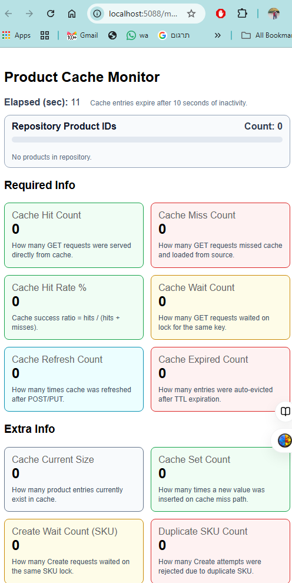

# ProductCatalog

## 1. How to run
clone the repo, and then From the repository root (in ProductCatalog.sln folder) open cmd / pws:

```bat
dotnet restore ProductCatalog.sln
dotnet build

to run api :
dotnet run --project ProductCatalog.API
```

If you already  builde the sln before , you can run RunAPI.bat:

```bat
cd runners
RunAPI.bat
```

new monitor page will be opened in yours browser:
`http://localhost:5088/monitor`

Then run the tester scenario run the bat file:

```bat
cd runners
run-http-scenario.bat
```
In case you preffer to ignored the web monitor page,  you can see all events colorized  in the console.

## 2. Example request flow
Typical flow I used while testing:

1. `POST /api/products` (create product)
2. `GET /api/products/{id}` (first read)
3. `GET /api/products/{id}` (second read)
4. `PUT /api/products/{id}` (update)
5. `GET /api/products/{id}` (verify updated value)

## 3. Cache hit/miss example
- For an id that is not in cache, first GET is a miss (loaded from the underlying in-memory store and then cached).
- Second GET for the same id is a hit (served from memory cache).
- In this implementation, POST/PUT refreshes cache immediately.
- Because of that, the next GET after POST/PUT is usually a hit and returns the updated value.
- Expiration strategy is Sliding TTL (`CacheSettings:TtlSeconds`, default 10s).

## 4. Key design notes (brief)
- Added `IProductCache` to keep caching logic out of the service layer.
- Using `IMemoryCache` with key format: `product:{id}`.
- Null results are not cached.
- Stampede prevention is handled with per-key lock + double-check in `GetOrCreateAsync`.


